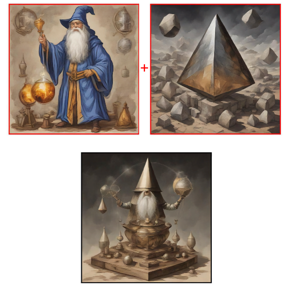

# SDXL Breeder

This is a tool for breeding Noken from SDXL. It's a work in progress.

We can generate many images per second -- this is one idea for exploring the latent
spaces between prompts.

## The idea

Explore sending nokens instead of tokens to CLIP for embedding.

## Capabilities:

- users can generate images from a prompt (seeding the universe)
- users can generate images by selecting two existing images, which then mixes their embeddings (latent space of token embeddings sent to CLIP for guidance) to generate a new image

### What?

Let's desconstruct what happens when you send a prompt to SDXL (Turbo):

    images = pipeline(prompt)

SDXL converts the prompt into `prompt_embeds` and `pooled_prompt_embeds` - and diffusers exposes 
a method `encode_prompt` that does this:

    prompt_embeds, _, pooled_prompt_embeds, _ = pipeline.encode_prompt(prompt)

Note: For this experiment we are ignoring negative prompts

While it is fun to play with this latent space (try replacing `prompt_embeds` with `torch.randn_like(prompt_embeds)`), what I want to do is deeper still.

Those `prompt_embeds` are 77-dimensional vectors generated by CLIP. SDXL utilizes two text_encoder/tokenizer - but the logic is very similar - tokenize the input, then call the text_encoder with those token ids:

    input_ids = tokenizer.encode(
        prompt,
        return_tensors="pt",
        padding="max_length",
        max_length=tokenizer.model_max_length,
    )
    
    prompt_embeds = text_encoder(input_ids=input_ids, output_hidden_states=True)
    pooled_prompt_embeds = prompt_embeds[0]
    prompt_embeds = prompt_embeds.hidden_states[-2].to("cpu")
    return prompt_embeds, pooled_prompt_embeds

While we can easily generate the token embeddings using CLIP, we cannot send these embeddings (or modifications of them) into the CLIP Text Encoder Model.

    def get_tok_embed(prompt, tokenizer, text_encoder):
        input_ids = tokenizer.encode(
            prompt,
            return_tensors="pt",
            padding="max_length",
            max_length=tokenizer.model_max_length,
        ).to(DEVICE)
        return text_encoder.get_input_embeddings()(input_ids)

With a small [patch](https://github.com/anotherjesse/transformers/commit/a3abf33474824cbdc9ab64873c1e057847d121bb) to HF Transformers we can send any token embeddings (`input_embeds`) we wish:

    def encode_tokens(inputs_embeds, text_encoder):
        prompt_embeds = text_encoder(inputs_embeds=inputs_embeds, output_hidden_states=True)
        pooled_prompt_embeds = prompt_embeds[0]
        prompt_embeds = prompt_embeds.hidden_states[-2].to("cpu")
        return prompt_embeds, pooled_prompt_embeds

Remembering that SDXL uses two different text_encoders, we can send nokens to both to generate the `prompt_embeds` and `pooled_prompt_embeds` that SDXL needs:

    def gen_prompt_embeds(tok_embeds):
        [lil_clip, big_clip] = tok_embeds

        pe1, _ = encode_tokens(lil_clip, pipeline.text_encoder)
        pe2, ppe2 = encode_tokens(big_clip, pipeline.text_encoder_2)

        prompt_embeds = torch.concat([pe1, pe2], dim=-1)
        pooled_prompt_embeds = ppe2  # SDXL only returns pooled prompt embeds text_encoder_2

        return prompt_embeds, pooled_prompt_embeds

And finally putting it all together:

    prompt_embeds, pooled_prompt_embeds = gen_prompt_embeds(token_embeds)

    images = pipeline(
        prompt_embeds=prompt_embeds,
        pooled_prompt_embeds=pooled_prompt_embeds,
        guidance_scale=0.0,
        num_inference_steps=1,
        num_images_per_prompt=num_images,
    ).images

This then allows us to modify the token embeddings we send in!  SLERP?  Genetic algorithms where users decide what survive to seed the next generate?

In `backend/engine.py` you can see a start to exploring this in the `mix` function.

## Status

- I've modified HF transformers to send token embeddings to CLIP instead of tokens - this
opens up sending nokens!
- Using SDXL Turbo makes this fast (enough) on MPS to start exploring
- The engine currently works on the entire space of 77 tokens - playing with the current UI suggests working on individual Nokens could allowed controlled madness.  
  - instead of breeding the entire token embedding, breed noken(s) to use in prompts: "A drawing in the style of [noken] of a whippet sleeping"
- the svelte app was created as a quick test - I've not spent much time on it

# Installation

## Backend

I highly recommend installing in a virtualenv as this requires a patched version of transformers.

    cd backend
    python3 -m venv .venv
    source .venv/bin/activate
    pip install -r requirements.txt

Then to start the backend:

    uvicorn main:app --reload --port 4444

## Frontend

For the draft svelte frontend:

    cd frontend
    npm install
    npm run dev

Then visit http://localhost:5173 to see the frontend.

- click "new prompt" to generate an image from a prompt
- click "breed" to generate an image by mixing the token embeddings of two existing images
- drag and drop images to breed them
- shift click an image to delete it
